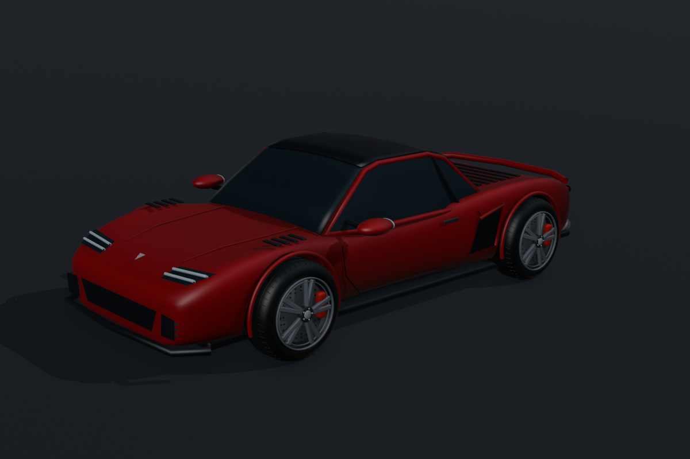

# AERON R01 — оригинальный спорткар

Редактируемая 3D-модель красного спортивного купе, созданная в **Blender 5.2.2 LTS** с помощью Python API и Codex.

## ⬇ Скачать модель

### [Скачать AERON_R01.blend — готовый проект Blender](https://raw.githubusercontent.com/zhann1982/aeron-r01-sportscar/main/AERON_R01.blend)

**Нажмите ссылку выше, чтобы скачать саму 3D-модель.** Это один файл `.blend` размером около 0,6 МБ: сцена, редактируемые объекты, материалы, освещение и камеры.

[Скачать весь проект одним ZIP-архивом](https://github.com/zhann1982/aeron-r01-sportscar/archive/refs/heads/main.zip) · [Открыть страницу файла на GitHub](https://github.com/zhann1982/aeron-r01-sportscar/blob/main/AERON_R01.blend)

Репозиторий публичный: для скачивания не нужны аккаунт GitHub, Git или GitHub Desktop. Обе ссылки на скачивание ведут к текущей версии в ветке `main`.

## Способ 1. Скачать только модель — самый короткий путь

1. Нажмите **[Скачать AERON_R01.blend](https://raw.githubusercontent.com/zhann1982/aeron-r01-sportscar/main/AERON_R01.blend)**.
2. Если браузер спрашивает, что сделать с файлом, выберите **Сохранить файл**. Если появляется окно выбора папки, укажите удобное место, например `Загрузки`, и нажмите **Сохранить**.
3. Дождитесь окончания загрузки. В Chrome и Edge на Windows список загрузок открывается сочетанием **Ctrl+J**.
4. Найдите `AERON_R01.blend` в списке загрузок. Нажмите значок папки или **Показать в папке**, чтобы узнать, где он сохранён. Обычно это папка `Загрузки`, но браузер может использовать другую папку.
5. Перейдите к разделу **«Как открыть модель в Blender»** ниже. Файл `.blend` распаковывать не нужно.

Если вместо скачивания открылась вкладка с содержимым файла, вернитесь сюда, нажмите правой кнопкой мыши на прямую ссылку и выберите **Сохранить ссылку как…**. Сохраните файл с именем `AERON_R01.blend`.

## Способ 2. Скачать модель со страницы файла на GitHub

Этот способ пригодится, если вы уже просматриваете список файлов репозитория.

1. Откройте [главную страницу проекта](https://github.com/zhann1982/aeron-r01-sportscar).
2. В списке файлов нажмите `AERON_R01.blend` или сразу перейдите на [страницу модели](https://github.com/zhann1982/aeron-r01-sportscar/blob/main/AERON_R01.blend).
3. Найдите **Download raw file** — кнопку скачивания со стрелкой вниз. Она находится в области просмотра файла; при наведении на значок появляется подсказка. Если GitHub показывает текстовую ссылку **Download**, можно воспользоваться ею.
4. Нажмите кнопку или ссылку скачивания, сохраните файл и дождитесь завершения загрузки.

GitHub может сообщить, что не умеет показывать этот файл. Для бинарного проекта Blender это нормально: скачайте его и откройте в Blender. Если найти кнопку не получилось, используйте [прямую ссылку на модель](https://raw.githubusercontent.com/zhann1982/aeron-r01-sportscar/main/AERON_R01.blend).

## Способ 3. Скачать весь проект ZIP-архивом

Выберите этот вариант, если хотите сохранить модель, изображение и инструкцию вместе.

1. Нажмите **[Скачать ZIP-архив](https://github.com/zhann1982/aeron-r01-sportscar/archive/refs/heads/main.zip)**. Другой путь: на [главной странице проекта](https://github.com/zhann1982/aeron-r01-sportscar) нажмите **Code → Download ZIP** над списком файлов.
2. Дождитесь загрузки архива `aeron-r01-sportscar-main.zip` и найдите его в папке загрузок браузера.
3. Распакуйте архив. На Windows: правая кнопка мыши по ZIP → **Извлечь всё… → Извлечь**. На macOS обычно достаточно дважды щёлкнуть ZIP-файл.
4. Откройте распакованную папку `aeron-r01-sportscar-main`. В ней находятся:

| Файл | Для чего он нужен |
| --- | --- |
| `AERON_R01.blend` | 3D-модель и сцена для открытия в Blender |
| `preview.png` | Готовое изображение модели для просмотра |
| `README.md` | Эта инструкция и описание проекта |

Открывайте `.blend` из распакованной папки. Сам ZIP-архив в Blender открывать не нужно. Подробнее о скачивании архива: [официальная инструкция GitHub](https://docs.github.com/en/repositories/working-with-files/using-files/downloading-source-code-archives).

## Как открыть модель в Blender

1. Если Blender ещё не установлен, скачайте его с [официального сайта Blender](https://www.blender.org/download/) и установите. Проект создан и проверен в **Blender 5.2.2 LTS**; в более старых версиях совместимость не проверялась.
2. Запустите Blender. Закройте стартовое приветственное окно щелчком вне него, если оно мешает.
3. Выберите **File → Open…** (в русской локализации — **Файл → Открыть…**) или нажмите **Ctrl+O**.
4. Если Blender предлагает сохранить текущую сцену, сохраните её, если она вам нужна. Затем продолжите открытие скачанного проекта.
5. В появившемся файловом окне перейдите в папку, где лежит скачанная модель. Если скачивали ZIP, выберите распакованную папку.
6. Выделите **`AERON_R01.blend`**. В нижнем поле имени файла должно быть именно `AERON_R01.blend`. Верхняя строка показывает путь к папке.
7. Нажмите **Open Blender File** или **Open** и дождитесь загрузки сцены. Файл `.blend` открывается через **Open**, отдельный импорт не требуется.
8. Вращайте вид средней кнопкой мыши и меняйте масштаб колесом. **NumPad 0** переключает вид из камеры и обратно. Если цифрового блока на клавиатуре нет, используйте **View → Cameras → Active Camera** в меню 3D-области.
9. Чтобы сохранить свою доработку отдельно от скачанного оригинала, выберите **File → Save As…** и задайте другое имя.

## Если что-то не получилось

- **Открылась страница GitHub, а не скачался файл.** Обычная ссылка на страницу модели показывает сведения о файле. Нажмите там **Download raw file** либо используйте [прямое скачивание](https://raw.githubusercontent.com/zhann1982/aeron-r01-sportscar/main/AERON_R01.blend).
- **Скачалась только картинка.** `preview.png` — превью. Для редактирования нужна модель `AERON_R01.blend`.
- **Файл не открывается двойным щелчком.** Сначала запустите Blender и откройте модель через **File → Open…**. Привязка расширения `.blend` к приложению для этого не нужна.
- **Blender пишет `Permission denied`, а в ошибке указан путь к папке.** Проверьте, что выделен файл `AERON_R01.blend`, а в нижнее поле не вставлен только путь к папке. Если ошибка указывает уже на сам файл, попробуйте заново скачать его в папку `Загрузки` и открыть оттуда.
- **Сохранился файл `.html`, `.txt` или размером 0 байт.** Вероятно, сохранена веб-страница или загрузка не завершилась. Повторите скачивание по прямой ссылке; простое переименование веб-страницы в `.blend` не превратит её в модель.
- **Модель не видна после открытия.** Наведите указатель на 3D-область и нажмите **NumPad 0**, чтобы перейти к подготовленной камере. Без цифрового блока используйте **View → Cameras → Active Camera**.
- **Скачиваете с телефона.** Файл можно сохранить или передать на компьютер; дальнейшие шаги этой инструкции рассчитаны на Blender на компьютере.

## Что входит в модель

- Красный кузов с отдельными колёсными арками и аэродинамическими деталями.
- Чёрная крыша, остекление и зеркала.
- Четыре колеса с составными дисками, тормозными роторами и суппортами.
- Передняя и задняя светотехника, воздухозаборники, выхлоп и диффузор.
- Студийная сцена с освещением и двумя камерами.

Объекты сгруппированы в коллекции: **Bodywork**, **Glass and trim**, **Wheels and brakes**, **Lighting and details**, **Studio**. Детали можно редактировать по отдельности.

Для изменения цвета кузова отредактируйте **Base Color** материала `Rosso / metallic lacquer`. **G / R / S** перемещают, поворачивают и масштабируют выделенный объект; **Tab** включает редактирование сетки; **Ctrl+S** сохраняет проект.

Изображение выше — проверочный рендер Workbench. В проекте также подготовлены свет и камеры для рендера в Cycles; время расчёта зависит от компьютера.

## Назначение

Это концептуальная модель экстерьера для визуализации и дальнейшего моделирования. Салон, инженерная конструкция, анимационный риг и подготовка к 3D-печати в эту версию не входят. Дизайн оригинальный, без использования автомобильных брендов.

---

**English:** An original red sports coupe concept made in Blender 5.2.2 LTS. The `.blend` file includes editable exterior components, wheels and brakes, materials, lights and two cameras. The preview is a Workbench render. This is an exterior visualization model, not an engineering or print-ready asset.
